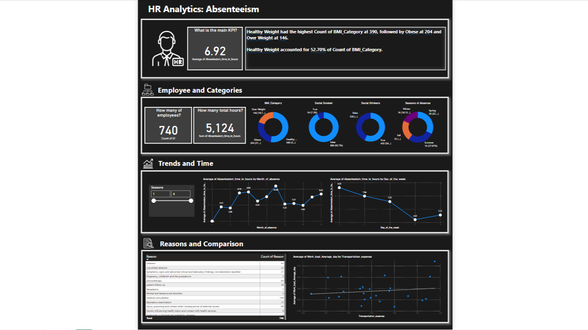

# HR Absenteeism Analysis – SQL & Power BI

This project analyzes employee absenteeism to help HR teams identify key trends, model bonus eligibility (e.g., for non-smokers), and support data-driven decisions.

## Tools Used
- **SQL Server Management Studio (SSMS)** – Data transformation and analysis
- **Power BI** – Dashboard and visualization
- **CSV Dataset** – Absenteeism records

## HR Reqeusts
- Provide a list of Healthy Individuals & Low Absenteeism for our healthy bonus program at Total Budget of $1OOO USD
- Calculate a Wage Increase or annual compensation for Non-Smokers for Insurance Budget of $983,221 for all Non-Smokers
- Create a Dashboard for HR to understand Absenteeism at work based on approved wireframe.
  
## Files Included
- `SQLQuery2.sql` – SQL queries used in the project
- `Dashboard.pbix` – Power BI dashboard file
- `Dashboard.pdf` – Final report export

## How to Use
1. Load the dataset into SQL Server
2. Run the SQL queries from `SQLQuery2.sql`
3. Open the Power BI file `Dashboard.pbix` to explore the dashboard

## ✅ Outcome
A visual, interactive HR dashboard that supports attendance analysis, bonus planning, and wellness decisions.

---

